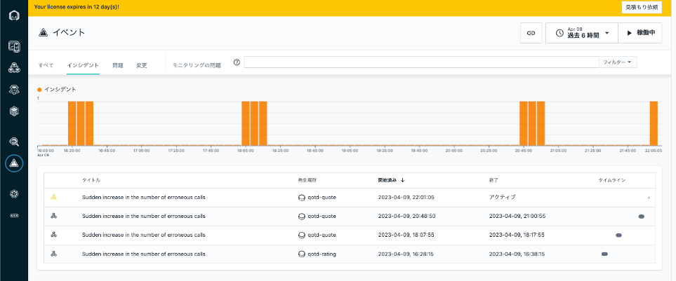
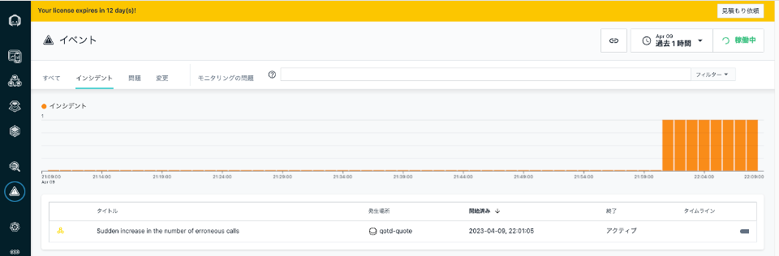
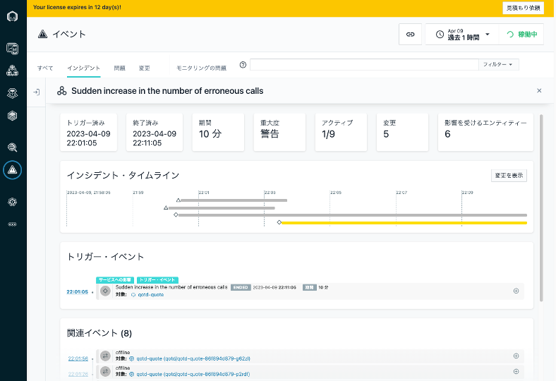
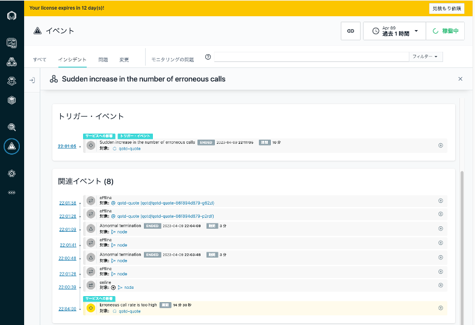
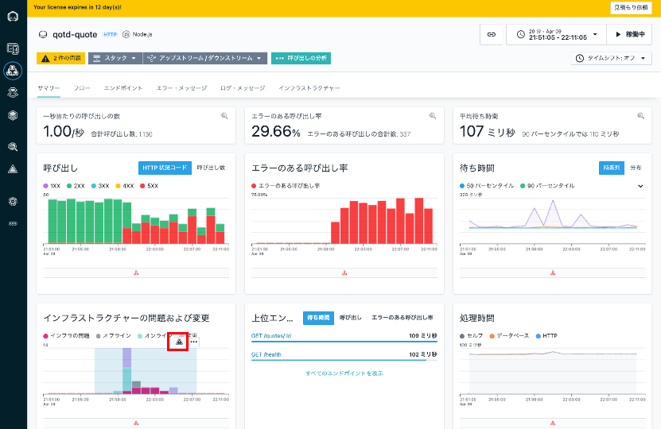
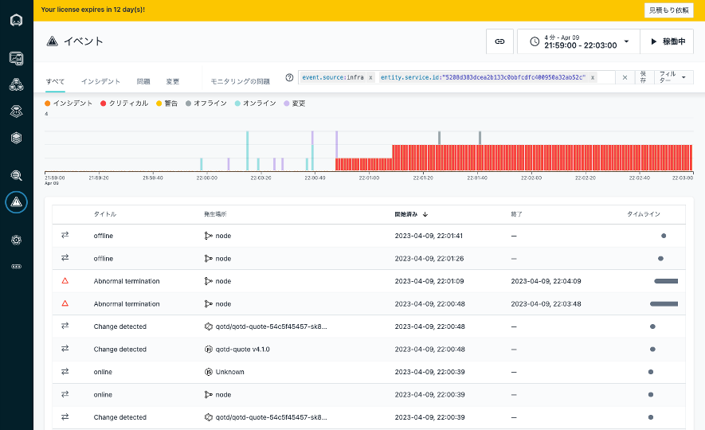

## イベント  

最後に イベントをみていきましょう。  
Instanaは、サービスの正常性を管理するため、各センサーのゴールデン・シグナル（トランザクション数、応答性能、エラー率など）に、機械学習を適用しています。  
応答性能の急激な低下や悪化、エラー率の急増など、ユーザーに影響を与えている通常の振る舞いと異なる状況を検知し、自動的に”インシデント"としてイベントを生成します。これにより、単純なしきい値監視では検知できない問題も拾っていくことできます。  
また、イベント通知時には、これまで見てきたようにサービスの前後上下のサービスのコンテキストを理解していますので、関連コンポーネントで発生している問題もあわせ、通知をあげます。
それではみていきましょう。
___

1. イベントを開きます。  
色がついているイベントはまだ解消されていない課題、グレーアウトされているイベントはすでに問題自体は解消されている課題です。　　
タイミングによっては、グレーの解消された課題しかない場合もありますので、その場合は そちらを見てみてください。
    
1. ここではわかりやすいよう、右上の**過去1時間**などの表示時間のボタンをクリックし、時間を絞り込んでいます。  
ここで表示されているイベントは qotd-quoteサービスでのエラー数の急増です。
    
1. qotd-qouteサービスのイベント通知を見ていきましょう。  
ここで、トリガーとなったイベント **トリガー・イベント**は、qotd-qouteサービスでのエラー率急増です。
    
1. スクロールダウンしていくと、トリガーとなったイベントだけでなく、あわせて関連するコンポーネントでのイベントの情報が**関連イベント**として、時系列で提示されています。

    

    ここでは、nodeのプロセスが2回**Abnormal termination**　発生して以上終了して、その後dockerコンテナで稼働する**qotd-quote**サービスが2回オフラインとなっており、２つの**qotd-quote**のPodでnodeのプロセスが動いていて、Podが停止したと考えられます。また、それが qotd-quoteサービスで検知されてるエラー率の急増につながっていますので、これが原因となっていることが想定されます。 
1. qotd-quoteサービスの リンクをクリックして、qotd-quote のダッシュボードを開きます。左下の**インフラストラクチャーの問題および変更**を確認します。ここで変更が起きている領域をマウスで選択し、 赤枠で囲った **▲** イベントの表示をクリックして詳細を確認しましょう。  
     
1. 発生した基盤的な変化が記録されていますので、こちらで時系列を追ってなにが起きていたかを確認することが可能です。各イベントを開くと、各サービスのメトリックやダッシュボードにアクセスすることが可能です。 ここでは、下記画像のグラフで、22:00前から水色のオンライン、紫色の変更とインフラの状態変更を繰り返したのち22:00:48からエラーが発生してます。これは何かしらリリース作業を行ったのではないかと推測されます。担当者に連絡する必要があります。

    

このように依存関係のある周辺サービスまで含めてイベントが通知されますので、エラー通知を受けて、各サーバーに入り、関連するサービスの状況をログから集めて調査を行う従来の監視の仕組みに比べ、よりスピーディに根本原因へとたどりつくことが期待されます。 
___
以上で、 Instanaのサンドボックを利用したハンズオンは終了です。お疲れさまでした。  
  
いかがでしたでしょうか？従来の基盤的なモニタリングと違い、実際の問題判別やアプリケーションの改善に繋げられるデータが多く可視化され、そして有機的に連携されていたのではないでしょうか？  
さらに一歩検証を進めて、ご自身のアプリケーション環境がどのように見えるかを試したい場合、[こちらのサイト](https://www.instana.com/getting-started-with-apm/)の**Free Trial**ボタンから２週間の無償PoCを申し込むことが可能です。ぜひ、試してみてください。
