## Web サイトおよびモバイル・アプリケーション

Instana では、ブラウザやモバイル・アプリケーションなど、エンドユーザー側の振る舞いを理解するための、エンドユーザー・モニタリングの機能も提供しています。  
ブラウザアプリケーション（Web画面）の場合は、JavaScriptのエージェントをコードのヘッダーに埋め込みます（くわしくは[こちら](https://www.ibm.com/docs/ja/instana-observability/current?topic=instana-monitoring-websites#installation)）。  
モバイル・アプリケーションの場合は、各環境向けのエージェントが用意されています。（くわしくは[こちら](https://www.ibm.com/docs/ja/instana-observability/current?topic=instana-mobile-app-monitoring)）  

---
### Web サイトのダッシュボード
1. Instanaの画面から、**Web サイトおよびモバイル・アプリケーション**を開いて、見ていきましょう。  
なおこのサンドボックスの環境には、モバイル・アプリケーションのアプリケーションは用意されていませんので、ここではWeb サイトのみをみていきます。    
    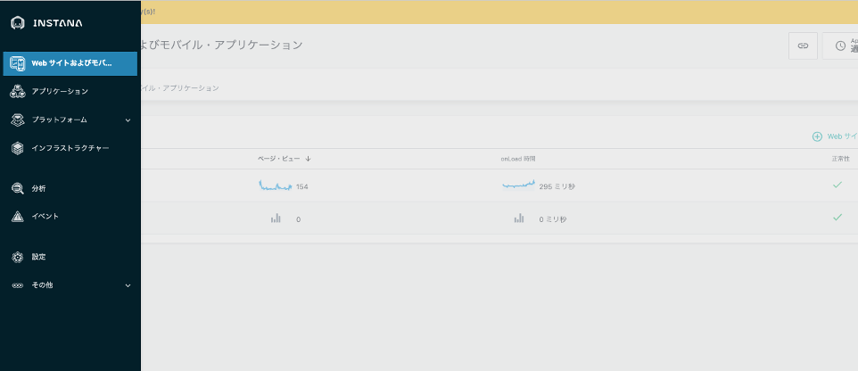
1. 定義されている **qotdアプリ**を開きます。
    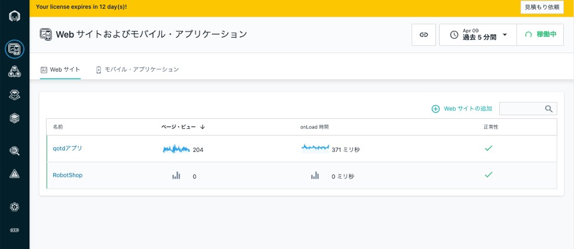
WebSitesモニタリングでは、各ブラウザに埋め込まれたエージェントから、直接Instanaのインスタンスにパフォーマンス状況が送信されてます。  
[注] このサンドボックスでは、Instanaの機能をお見せするために個別ユーザーを特定できる情報まで送信していますが、デフォルトでは 個人を特定できる情報は送信されません。UserAPIを使用するよう管理者の構成が必要となります。  
WebSitesモニタリングで送信される情報については、[こちら](https://www.ibm.com/docs/en/instana-observability/current?topic=websites-website-monitoring-faq#sensitive-data)をご確認ください。
1. QOTDアプリ のサイトのパフォーマンスのオーバービューが表示されます。ページビュー数やJavaScriptのエラー、ページのロード時間などが表示されています。
    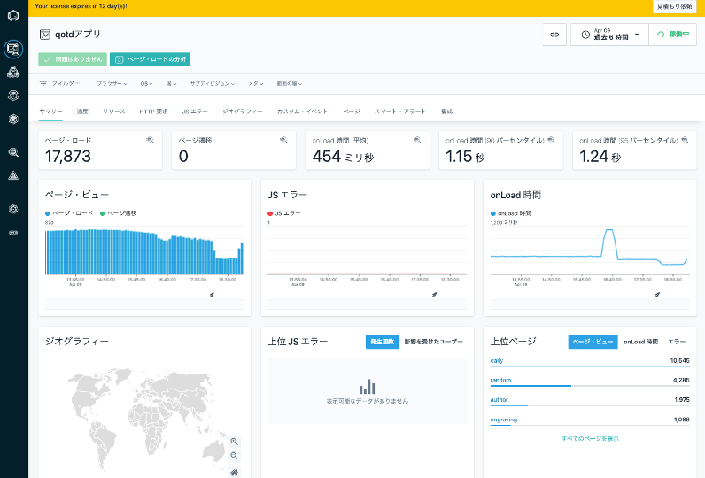
1. **速度**のタブには、Webサイトの応答性能の詳細情報が表示されています。
    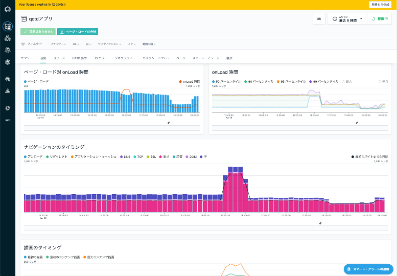
1. **リソース**のタブには、qotdアプリサイトが読み込んでいる外部リソースのパフォーマンスが表示されています。
    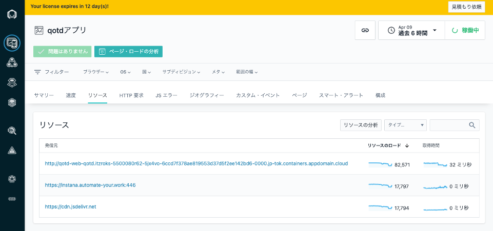
1. その他のタブについて、確認してみてください。またタブの上のフィルターを利用すると、ブラウザーの種類やOSで情報を絞り込むことが可能です。

### Web サイトの問題判別
1. **サマリー**のページに戻ります。
アプリケーションのページと同様、エラーにフォーカスを当てて、詳細を確認します。
    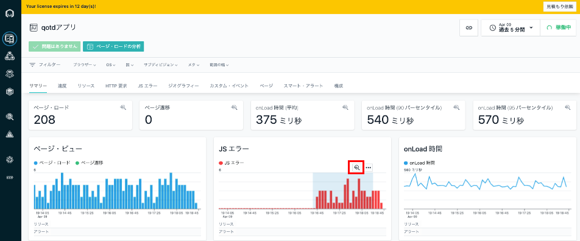
1. ここでは、**Uncaught ReferenceError: Darkmode is not defined**のエラーが発生しています。詳細を確認するために**Uncaught ReferenceError: Darkmode is not defined**を選択します。  
タイミングによって起きているエラーは異なりますので、環境に応じて 一番多いエラーを選択して開いて下さい。
    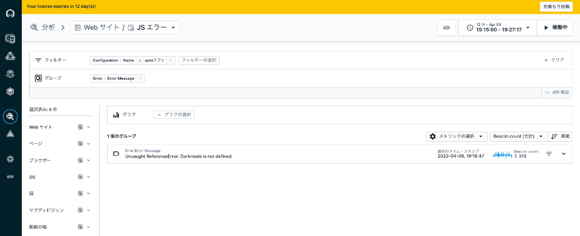
1. ここでも、**Uncaught ReferenceError: Darkmode is not defined**のエラーのみが出力されている状況です。  
一番上のエラー要求をクリックして、要求の中身をみていきます。
    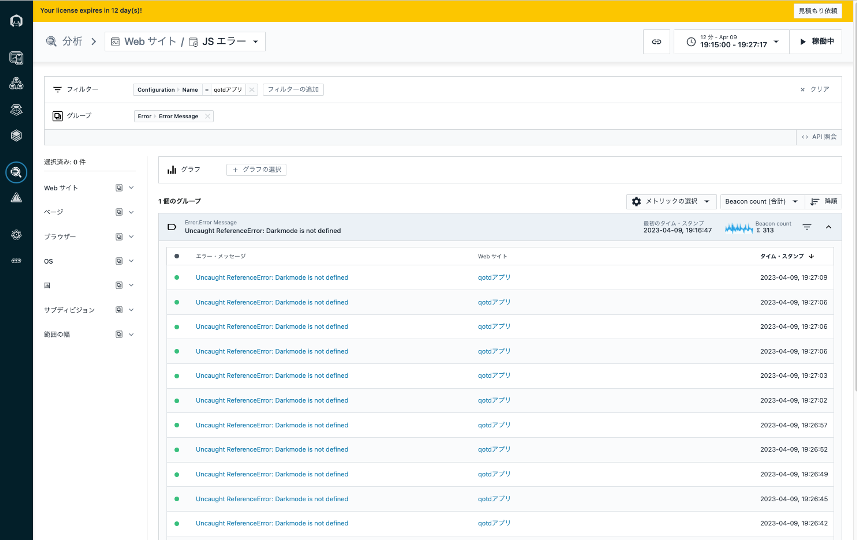
1. 問題が発生している JavaScript にフォーカスがあたっていますので、確認します。  
    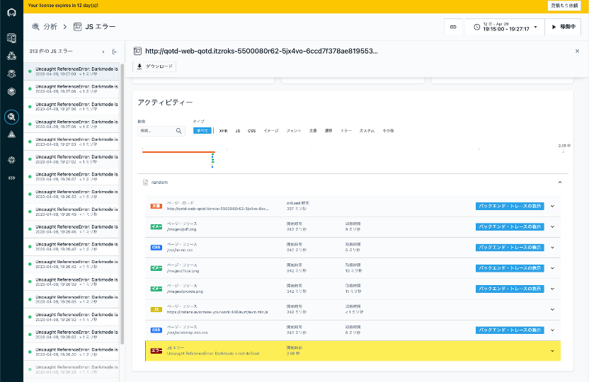
1.  ここではJavaScriptのどの行で どんなエラーが返されているかが分かります。今回はaddDarkmodeWidgetが定義されていないとQOTDアプリケーションURLの18行目に問題があるようです。
    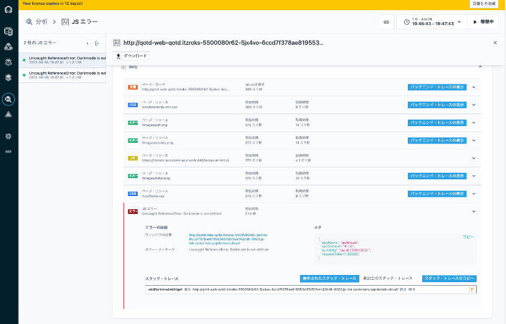
1. QOTDアプリケーションをブラウザーでソースコードを参照すると 下記画像の赤枠のDarmode widgetのスクリプトを読み込む際に**src**と書くべきところを**ssrc**とタイプミスしたのが原因のようです。 
    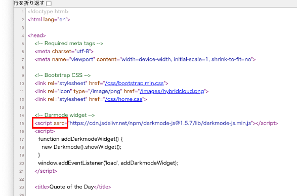
1. なお、ブラウザから呼び出している Backendサービスがある場合には、以下のように **バックエンド・トレースの表示**のボタンがあります。ここでは一番上のページ・ロードをクリックします。
    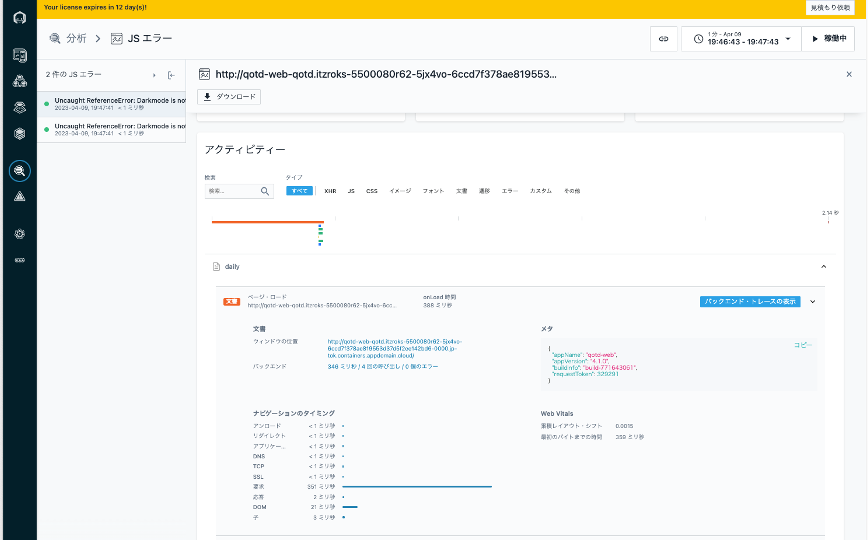
1. これをクリックすると、先程見てきたサーバー側の解析画面に飛ぶことができます。 これにより、フロントエンドのWebアプリケーションから、バックエンドのシステムまで、一つのコンソールから追って確認することが可能です。
    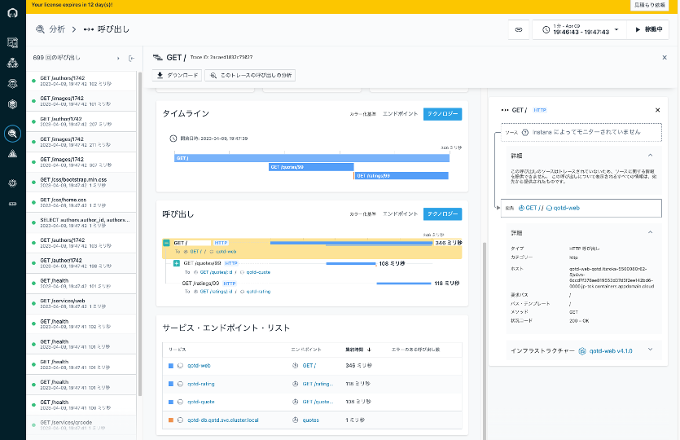

[参考]
今回はエラーが発生した箇所がJavascriptファイルでなかったため、スタックトレースが表示されませんでした。JavaScriptでエラーが発生した場合は下記画像のようにratings の JavaScriptのどの行で どんなエラーが返されているかが分かります。ここでは Error Detailsのメッセージから 1-5が許される値に6が入力され、エラーとなっていることが分かるように、スタックトレースが表示されます。
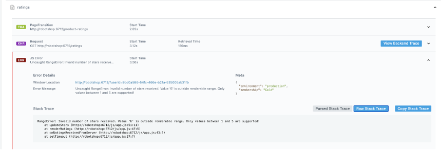

---
ここまでで、**Web サイトおよびモバイル・アプリケーション**のハンズオンは終了です。最後は、[イベント](Events.md)を見ていきましょう。

