## ダッシュボード
Instana を開くと、以下のような画面が表示されます。  
  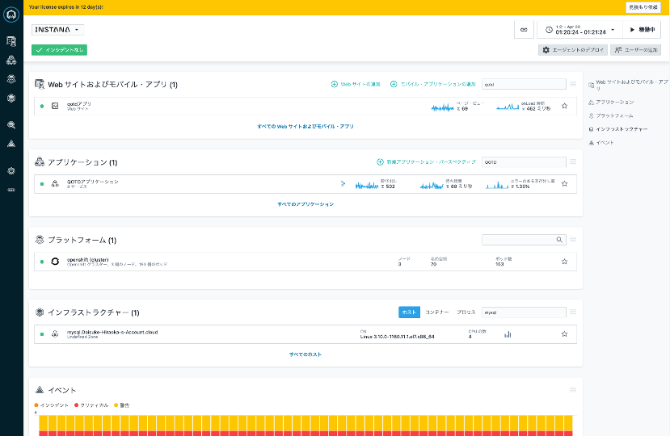
  
左のメニューにあるように Instanaでは、インフラストラクチャー から、プラットフォーム、アプリケーション さらには Web サイトおよびモバイル・アプリケーション (エンドユーザー・モニタリング）まで多様な環境を見ていくことが可能です。
  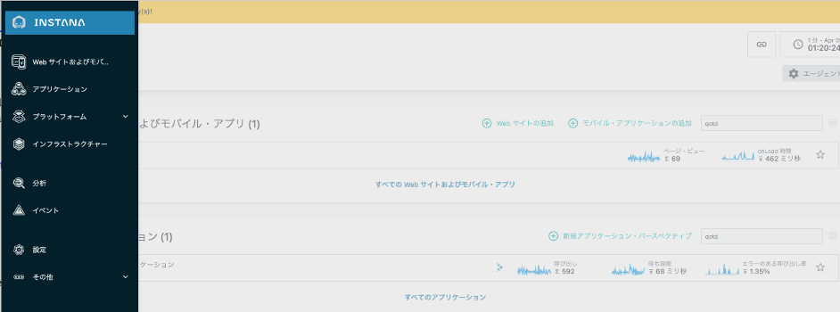

それでは、この環境で IBM Instana Observability を、順に見ていきましょう。  
まず 取得した各種メトリックが統合されている Infrastructure & Platform の足回りから見ていきます。  
なお、このサンドボックス環境は実際にバックエンドで動いていて、擬似的に問題も発生させている環境ですので、開いたタイミングによって 表示される内容や発生するエラーは異なりますので、ご留意ください。

---

## インフラストラクチャー 
1. Instanaの右のメニューから、**インフラストラクチャー**のアイコンをクリックしてください。
  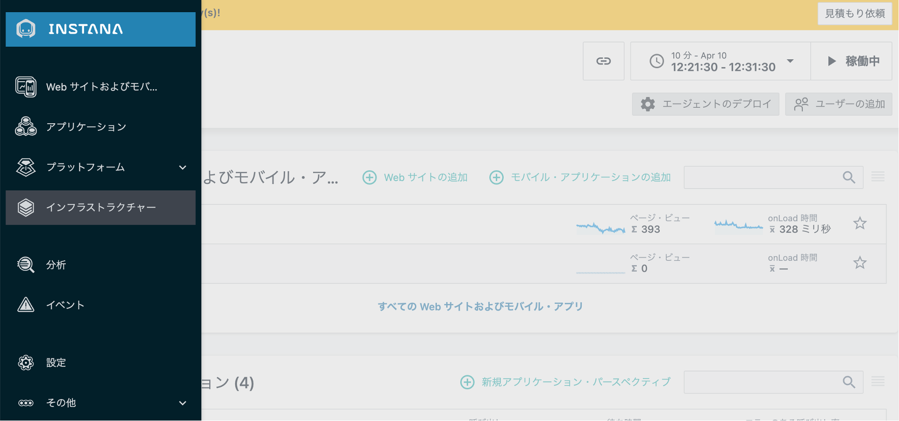
1. インフラストラクチャーでは、エージェントが導入されている各ホスト・ノードが 一元化されて把握できるようになっています。  
エージェントには、ゾーンを関連づけ、カスタマイズすることもできるので、クラウドのゾーンだけでなく、東京データセンター、大阪データセンターなど、自由に関連付けて管理することが可能です。
　　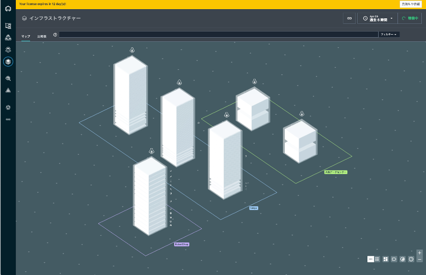

1. 上の **比較表** をクリックすると、一覧表示で、ホストや各種コンテナーをリストアップできます。再び **マップ**に戻ります。　　
　　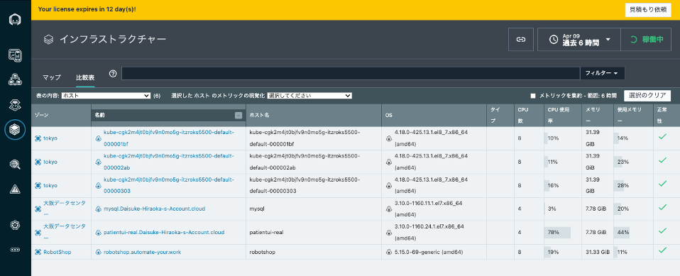

1. 色が付いているブロックがあれば、そこは問題が発生している環境です（環境のタイミングによって、存在するとはかぎりません）。例えば、下記画像の黄色いブロックは、**ユーザープロセスのCPU使用率が高すぎる**問題が発生しています。
  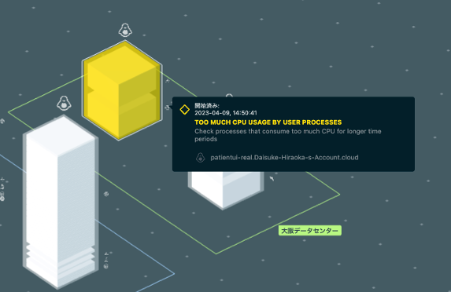

1. **tokyo** ゾーンは、OpenShift(Kubernetes)環境のノードです。３つあるブロックのうち、１つのブロックの外枠をクリックすると、そのノードで検知されているテクノロジーのスタックが表示されます。  
左にはそのノードの詳細が表示されます。この画面ではホスト名に加えてOSがLinuxであること、そしてそのホストのCPU、メモリなど確認することができます。
  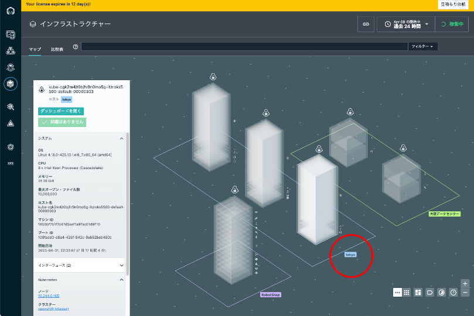
1. ノード情報の下の方には、そのノードで稼働する各種サービスのスタックが表示されています。それそれリンクになっていますので、検知されたサービスのダッシュボードへと飛ぶことも可能です。
  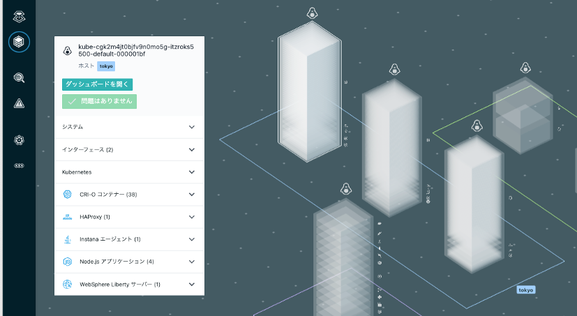
1. ノード情報の上の方にある 緑色の **ダッシュボードを開く** の画面を開きます。ノードのリソースの詳細情報が確認できます。  
CPUやメモリの利用量から、Open Files数、File Systemの情報、ネットワークのアクティビティなど、基盤的な情報を確認することができます。メトリックは１秒単位の高精細なデータで、スパイクを見逃しません。
  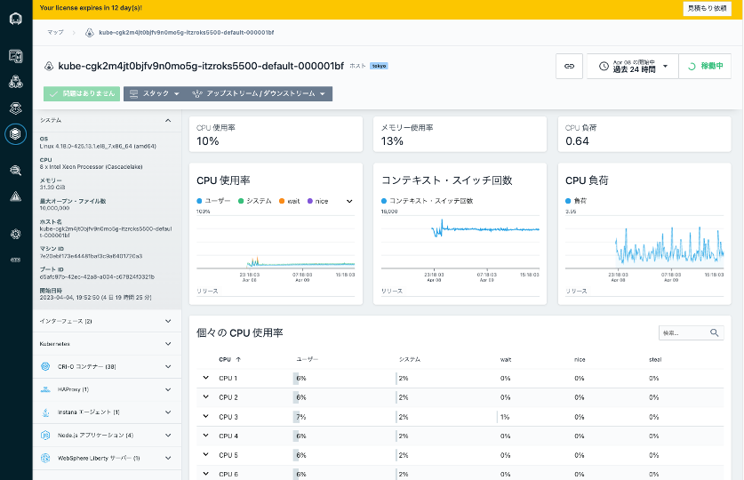
1. 上の **スタック**タブをクリックすると、このノードで稼働しているアプリケーションやインフラストラクチャーのスタックの情報が確認できます。

  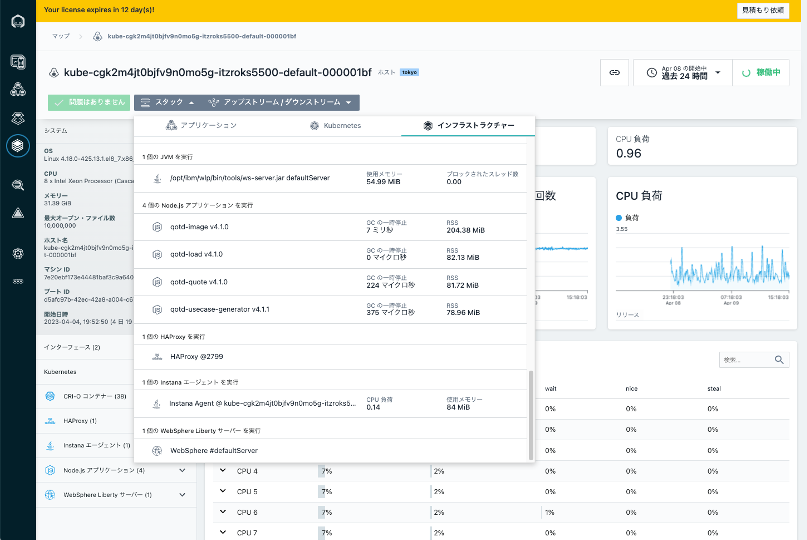

---
## プラットフォーム
1. つぎにアプリケーションが稼働するプラットフォームを見ていきましょう。KubernetesやCloudFoundry、この環境には表示されていませんが vSphereや PowerVM の情報も見ていくことが可能です。
  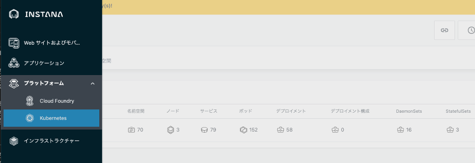
1. ひとつ定義されている openshift (cluster) が確認できます。右端のHealthはグリーンで大きな問題はないようですね。  
openshift (cluster) のリンクをクリックして、見ていきましょう。
  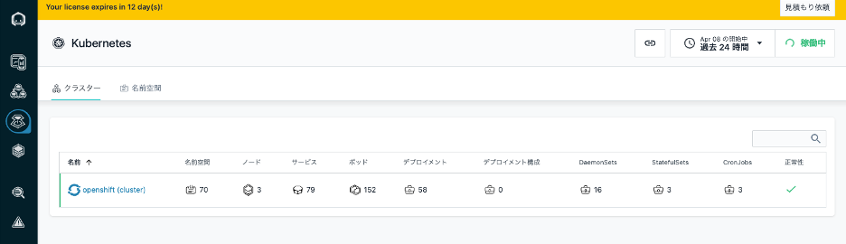
1. 各クラスター全体のダッシュボードが開きます。  
CPUやメモリーなどのリソース状況、利用状況上位のノードや名前空間のリストがあります。
  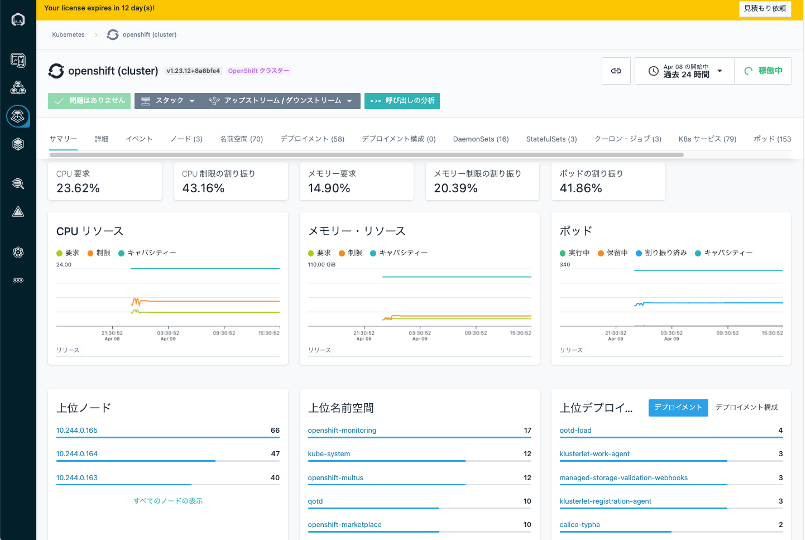
1. 先程と同様、メニューの **スタック**をクリックすると、このクラスターに関係する アプリケーションやInfrastructure の情報がリストされて表示されます。
  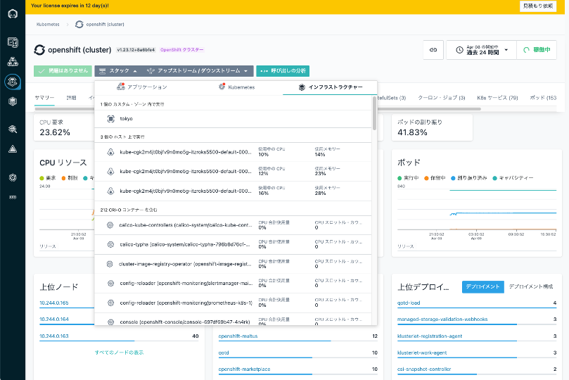

1. Kubernetesの各種リソースがタブとして整理されていますので、確認してみてください。  
とくに Pod のタブでは、リソースの CPU制限/CPU要求(Requests/Limits)の値をグラフィカルに表示することもできますので、どの名前空間のPodがリソースを消費する設定となっているかなど確認することができます。
  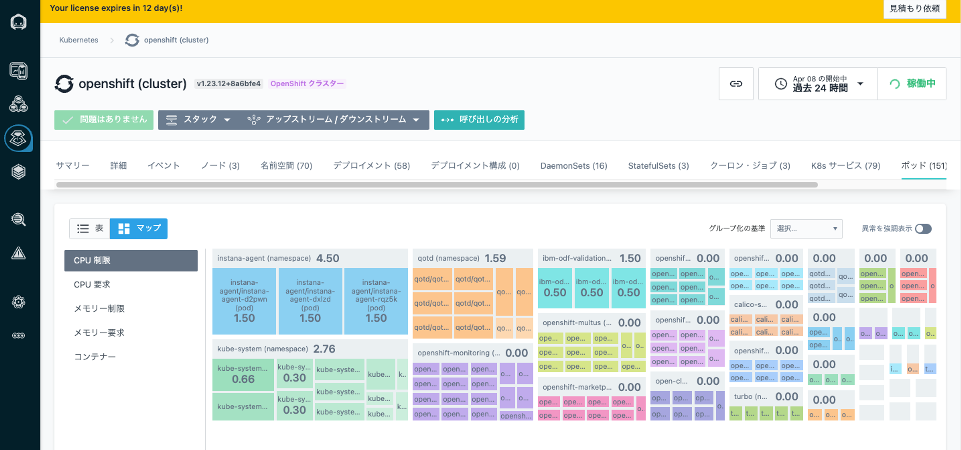
1. 気になる Podがあれば、その Podの情報をクリックすることで、Podのダッシュボードに移動し、実際のリソース利用状況などを確認できます。
  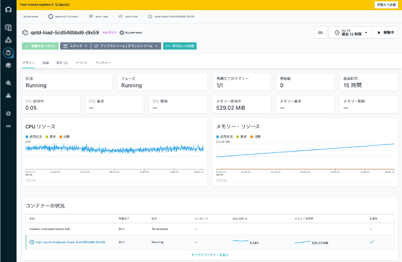

---
【参考】  
このInstana環境には含まれていませんが、製品版では Open Betaのステータスで Kubernetesの各コンテナの出力するログ・メッセージをInstanaで集約表示する Kubernetes Logging 機能を提供しています。
クラスター、名前空間、Pod、コンテナーの各レベルにおいて、ログ・メッセージを表示することが可能です。また解析機能を使って、サービスごとにまとめて表示するなど、Kubernetes/OpenShift環境での問題判別が加速する機能ですね。GAして早くお届けできることを楽しみにしています。

---
これで **インフラストラクチャー & プラットフォーム** の確認は終わりです。  
様々な環境に関わるリソース情報が整理され、それぞれ関連付けられて、コンソールに統合されていることが理解頂けたと思います。  
次にトレースとログの解析結果を可視化している [アプリケーション](Applications.md) を見ていきたいと思います。

